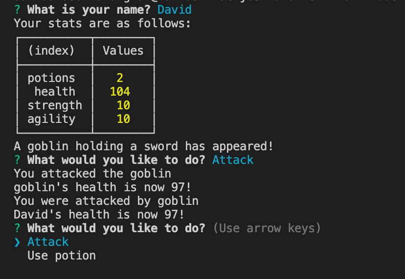

# jest-another-RPG

Command Line game using OOP in Node



|                                         |                                                               |                                                   |
| :-------------------------------------: | :-----------------------------------------------------------: | :-----------------------------------------------: |
|    [Introduction](#jest-another-RPG)    |            [Table of Contents](#table-of-contents)            | [Development Highlights](#development-highlights) |
|         [Deployment](#deployed)         | [Description of Page Building](#Description-of-Page-Building) |       [Code Hightlights](#code-highlights)        |
| [Technologies Used](#Technologies-Used) |                      [Credits](#Credits)                      |                [License](#License)                |

## Development Highlight

- Use object oriented programming to create characters.
- Use Jest for test driven development to create classes.
- Use Inquirer to gather user input.

## Deployment

Install dependencies.

```
npm i
```

Run the app.

```
node app.js
```

## Test

```
npm test
```

## Description of Page Building

### Organization

- test
- lib
- .gitignore
- app.js
- License
- package.json
- package-lock.json
- Demo

### Desctiption

The classes are in the "lib." The tests for the lib are tin the "test". App.js runs the game.

## Code Highlights

Creating a "Character" class where Enemy and Player will inherit from.

```JavaScript
class Character {
    constructor(name = '') {
        this.name = name;
        this.health = Math.floor(Math.random() * 10 + 95);
        this.strength = Math.floor(Math.random() * 5 + 7);
        this.agility = Math.floor(Math.random() * 5 + 7);

    }
    isAlive() {
        if (this.health === 0) {
            return false;
        }
        return true;
    }

    getHealth() {
        return `${this.name}'s health is now ${this.health}!`;
    }
    getAttackValue() {
        const min = this.strength - 5;
        const max = this.strength + 5;

        return Math.floor(Math.random() * (max - min) + min);
    }
    reduceHealth(health) {
        this.health -= health;

        if (this.health < 0) {
            this.health = 0;
        }

    }
}
```

Enemy class inheriting from Character class.

```JavaScript
class Enemy extends Character {
    constructor(name, weapon) {
        super(name);

        this.weapon = weapon;
        this.potion = new Potion();
    }

    getDescription() {
        return `A ${this.name} holding a ${this.weapon} has appeared!`;
    }
}
```

## Technologies Used

### Backend Languages

- [Node.js](https://nodejs.org/en/)

### NPM Dependencies

- [Inquirer.js](https://www.npmjs.com/package/inquirer)

### Testing

- [jest](https://jestjs.io/);

## Credits

|                           |                                                                                                                                                                                                       |
| ------------------------- | ----------------------------------------------------------------------------------------------------------------------------------------------------------------------------------------------------- |
| **David Anusontarangkul** | [ LinkedIn](https://www.linkedin.com/in/anusontarangkul/) [ GitHub](https://github.com/anusontarangkul) |

## License

[](https://opensource.org/licenses/MIT)
